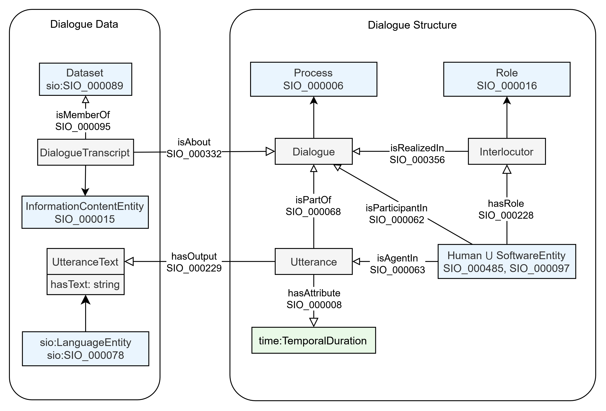

# dialogueOnt



## Repository Structure

- [Requirements.md](docs/Requirements.md): Ontology requirements including goals, scope, and target audience.
- [CompetencyQuestions.md](docs/CompetencyQuestions.md): Functional requirements expressed as competency questions.
- [Terms.md](docs/Terms.md): List of terms, prefixes, and definitions used in the ontology.
- [DevelopmentDescription.md](docs/DevelopmentDescription.md): Overview of the ontology development process and methodology, as well as resources used in development.
- [AlignmentDemonstration.md](docs/AlignmentDemonstration.md): Demonstration of semantic alignment and querying across disparate dialogue corpora (AMI and DailyDialog).
- `src/`: Contains core ontology files (`ontology/`), scripts (`scripts/` including alignment and joint query demo scripts), and SPARQL queries (`sparql/`). `src/ontology/data/` contains downloaded and processed dataset files.
- `docs/`: Contains the documentation pages for the DIDO ontology hosted at https://shmewtep.github.io/DiDO/. An interactive query interface is available via TriplyDB.
- `dido*.(owl|ttl)`: The most recent public releases of the core ontology files.

## Usage

The most recent release of the ontology is available in the root directory of the repository, while the edit version is available in the `src/ontology` directory.

### SPARQL Endpoint

You can query an instance of the DiDO ontology loaded with an example from the AMI corpus (ES2002b) via TriplyDB:
* **Interactive UI:** [https://triplydb.com/KelseyRook/AMIES2002bDiDO/sparql](https://triplydb.com/KelseyRook/AMIES2002bDiDO/sparql)
* **API Endpoint:** `https://api.triplydb.com/datasets/KelseyRook/AMIES2002bDiDO/sparql`

Multiple versions of the ontology are available including `dido-base`, `dido-full`, and `dido`.

* `dido-base`: The core ontology containing classes introduced by DIDO.
* `dido-full`: The full ontology containing all classes and axioms including those from imports.
* `dido`: Currently the same as `dido-full`.

### Aligning Dialogue Datasets

The `src/scripts/download_align_dataset.py` script can be used to convert dialogue transcripts from the AMI or DAIC-WOZ datasets into RDF format aligned with the DIDO ontology.

**For the AMI dataset:**

You can download the dataset directly from HuggingFace and align it by using the `--download` flag. The transcript file will be automatically saved to `src/ontology/data/dialog_ami/`.

While the script streams the dataset from HuggingFace without keeping any of the audio files, the ```librosa``` and ```soundfile``` libraries may still be required to be installed for the dataset download to work.

To download a specific dialogue:
```bash
python src/scripts/download_align_dataset.py --dataset ami --dialogue_id EN2001a --download
```

To download and align multiple specific dialogues at once:
```bash
python src/scripts/download_align_dataset.py --dataset ami --dialogue_id EN2001a ES2002a --download
```

To download the first *n* dialogues (e.g., the first 5):
```bash
python src/scripts/download_align_dataset.py --dataset ami --download --n 5
```

To download and align **all** available dialogues in the dataset (Warning: this might take a while):
```bash
python src/scripts/download_align_dataset.py --dataset ami --download
```

If you already have the transcript file locally, provide the `--dialogue_location`:
```bash
python src/scripts/download_align_dataset.py --dataset ami --dialogue_id EN2001a --dialogue_location src/ontology/data/dialog_ami/EN2001a.jsonl
```

**For the DAIC-WOZ dataset:**
Note: Downloading is currently not supported for DAIC-WOZ. You must explicitly provide the dialogue location. This dataset is available by request from [DAIC-WOZ](https://dcapswoz.ict.usc.edu/) for academics and other non-profit researchers.
```bash
python src/scripts/download_align_dataset.py --dataset daicwoz --dialogue_id 301 --dialogue_location src/ontology/data/dialog_daicwoz/301_TRANSCRIPT.csv
```

**Additional Options:**
You can specify a custom output directory using the `--output_dir` parameter for the resulting alignments:
```bash
python src/scripts/download_align_dataset.py --dataset ami --dialogue_id EN2001a --download --output_dir custom/path/
```
